# Sentiment on a subject from trust graph assertions

> click on assertion ID to jump to details

```mermaid
graph RL
  0["👎🔴 <a href='#assertion-root'>root</a> <br>-0.574 = 0.490 + -0.092 + -0.328 + 0.092 + -0.353 + 0.092 + -0.293 + 0.092 + -0.246 + -0.121 + 0.092"]
  1["👍🟢 <a href='#assertion-%40chr15%2Fi_trust-1'>@chr15/i_trust-1</a> <br>0.398 = 0.490 + -0.092"]
  1 --> 0
  2["👎🔴 <a href='#assertion-%40attacker%2Fi_trust-meta-dispute-chr15'>@attacker/i_trust-meta-dispute-chr15</a> <br>-0.092 = -0.092"]
  2 --> 1
  3["👎🔴 <a href='#assertion-%40sam%2Fi_trust-1'>@sam/i_trust-1</a> <br>-0.235 = -0.328 + 0.092"]
  3 --> 0
  4["👎🔴 <a href='#assertion-%40attacker%2Fi_trust-meta-dispute-sam'>@attacker/i_trust-meta-dispute-sam</a> <br>-0.092 = -0.092"]
  4 --> 3
  5["👎🔴 <a href='#assertion-%40n4t4l13%2Fi_trust-1'>@n4t4l13/i_trust-1</a> <br>-0.261 = -0.353 + 0.092"]
  5 --> 0
  6["👎🔴 <a href='#assertion-%40attacker%2Fi_trust-meta-dispute-n4t4l13'>@attacker/i_trust-meta-dispute-n4t4l13</a> <br>-0.092 = -0.092"]
  6 --> 5
  7["👎🔴 <a href='#assertion-%40d4v1d%2Fi_trust-1'>@d4v1d/i_trust-1</a> <br>-0.447 = -0.293 + 0.092 + -0.246"]
  7 --> 0
  8["👎🔴 <a href='#assertion-%40attacker%2Fi_trust-meta-dispute-d4v1d'>@attacker/i_trust-meta-dispute-d4v1d</a> <br>0.154 = -0.092 + 0.246"]
  8 --> 7
  9["👎🔴 <a href='#assertion-%40tom%2Fi_trust-2'>@tom/i_trust-2</a> <br>-0.246 = -0.246"]
  9 --> 8
  10["👎🔴 <a href='#assertion-%40rachel%2Fi_trust-1'>@rachel/i_trust-1</a> <br>-0.029 = -0.121 + 0.092"]
  10 --> 0
  11["👎🔴 <a href='#assertion-%40attacker%2Fi_trust-meta-dispute-rachel'>@attacker/i_trust-meta-dispute-rachel</a> <br>-0.092 = -0.092"]
  11 --> 10
```




  
## Assertion Details

### <a id="assertion-root"></a>Assertion: root

- **Accumulated Score**: -0.574

*Assertion details not available*

### <a id="assertion-%40chr15%2Fi_trust-1"></a>Assertion: @chr15/i_trust-1

- **Accumulated Score**: 0.398

```json
{
  "issuer": "@chr15/i_trust",
  "issuerSpecificID": "1",
  "claim": {
    "type": "endorse",
    "comment": "This is some scary stuff m8"
  },
  "subject": {
    "pkg": {
      "name": "semver",
      "range": "<5.7.2"
    },
    "flaw": {
      "cwe": "CWE-1333"
    }
  },
  "trust": 0.49009773662551437
}
```

### <a id="assertion-%40attacker%2Fi_trust-meta-dispute-chr15"></a>Assertion: @attacker/i_trust-meta-dispute-chr15

- **Accumulated Score**: -0.092

```json
{
  "issuer": "@attacker/i_trust",
  "issuerSpecificID": "meta-dispute-chr15",
  "claim": {
    "type": "dispute",
    "comment": "Chr15's assessment of the advisory severity is subjective and not based on standard metrics"
  },
  "subject": {
    "assertion": {
      "issuer": "@chr15/i_trust",
      "issuerSpecificID": "1"
    }
  },
  "trust": 0.0923464425797325
}
```

### <a id="assertion-%40sam%2Fi_trust-1"></a>Assertion: @sam/i_trust-1

- **Accumulated Score**: -0.235

```json
{
  "issuer": "@sam/i_trust",
  "issuerSpecificID": "1",
  "claim": {
    "type": "dispute",
    "comment": "There's no point in worrying about the ReDoS in all semver versions"
  },
  "subject": {
    "pkg": {
      "name": "semver"
    },
    "flaw": {
      "cwe": "CWE-1333"
    }
  },
  "trust": 0.32753825874485576
}
```

### <a id="assertion-%40attacker%2Fi_trust-meta-dispute-sam"></a>Assertion: @attacker/i_trust-meta-dispute-sam

- **Accumulated Score**: -0.092

```json
{
  "issuer": "@attacker/i_trust",
  "issuerSpecificID": "meta-dispute-sam",
  "claim": {
    "type": "dispute",
    "comment": "Sam's claim about the limited scope of the vulnerability is not supported by evidence"
  },
  "subject": {
    "assertion": {
      "issuer": "@sam/i_trust",
      "issuerSpecificID": "1"
    }
  },
  "trust": 0.0923464425797325
}
```

### <a id="assertion-%40n4t4l13%2Fi_trust-1"></a>Assertion: @n4t4l13/i_trust-1

- **Accumulated Score**: -0.261

```json
{
  "issuer": "@n4t4l13/i_trust",
  "issuerSpecificID": "1",
  "claim": {
    "type": "dispute",
    "comment": "The impact of CWE-1333 on semver is minimal and does not warrant the current advisory"
  },
  "subject": {
    "pkg": {
      "name": "semver",
      "range": "<5.7.2"
    },
    "flaw": {
      "cwe": "CWE-1333"
    }
  },
  "trust": 0.3529771090534977
}
```

### <a id="assertion-%40attacker%2Fi_trust-meta-dispute-n4t4l13"></a>Assertion: @attacker/i_trust-meta-dispute-n4t4l13

- **Accumulated Score**: -0.092

```json
{
  "issuer": "@attacker/i_trust",
  "issuerSpecificID": "meta-dispute-n4t4l13",
  "claim": {
    "type": "dispute",
    "comment": "N4t4l13's assessment of the vulnerability's impact is overly optimistic"
  },
  "subject": {
    "assertion": {
      "issuer": "@n4t4l13/i_trust",
      "issuerSpecificID": "1"
    }
  },
  "trust": 0.0923464425797325
}
```

### <a id="assertion-%40d4v1d%2Fi_trust-1"></a>Assertion: @d4v1d/i_trust-1

- **Accumulated Score**: -0.447

```json
{
  "issuer": "@d4v1d/i_trust",
  "issuerSpecificID": "1",
  "claim": {
    "type": "dispute",
    "comment": "It's a ReDoS in a semver matcher. Seriouslt?"
  },
  "subject": {
    "pkg": {
      "name": "semver",
      "range": "<5.7.2"
    },
    "flaw": {
      "ghsa": "GHSA-c2qf-rxjj-qqgw"
    }
  },
  "trust": 0.2932179140946499
}
```

### <a id="assertion-%40attacker%2Fi_trust-meta-dispute-d4v1d"></a>Assertion: @attacker/i_trust-meta-dispute-d4v1d

- **Accumulated Score**: 0.154

```json
{
  "issuer": "@attacker/i_trust",
  "issuerSpecificID": "meta-dispute-d4v1d",
  "claim": {
    "type": "dispute",
    "comment": "D4v1d's version range assessment is too narrow"
  },
  "subject": {
    "assertion": {
      "issuer": "@d4v1d/i_trust",
      "issuerSpecificID": "1"
    }
  },
  "trust": 0.0923464425797325
}
```

### <a id="assertion-%40tom%2Fi_trust-2"></a>Assertion: @tom/i_trust-2

- **Accumulated Score**: -0.246

```json
{
  "issuer": "@tom/i_trust",
  "issuerSpecificID": "2",
  "claim": {
    "type": "dispute",
    "comment": "That guy produces suspicious claims"
  },
  "subject": {
    "assertion": {
      "issuer": "@attacker/i_trust",
      "issuerSpecificID": "meta-dispute-d4v1d"
    }
  },
  "trust": 0.24622837898662545
}
```

### <a id="assertion-%40rachel%2Fi_trust-1"></a>Assertion: @rachel/i_trust-1

- **Accumulated Score**: -0.029

```json
{
  "issuer": "@rachel/i_trust",
  "issuerSpecificID": "1",
  "claim": {
    "type": "dispute",
    "comment": "Our analysis shows that there's no practical risk involved in using semver"
  },
  "subject": {
    "pkg": {
      "name": "semver"
    },
    "flaw": {
      "ghsa": "GHSA-c2qf-rxjj-qqgw",
      "url": "https://github.com/advisories/GHSA-c2qf-rxjj-qqgw"
    }
  },
  "trust": 0.12122034143518522
}
```

### <a id="assertion-%40attacker%2Fi_trust-meta-dispute-rachel"></a>Assertion: @attacker/i_trust-meta-dispute-rachel

- **Accumulated Score**: -0.092

```json
{
  "issuer": "@attacker/i_trust",
  "issuerSpecificID": "meta-dispute-rachel",
  "claim": {
    "type": "dispute",
    "comment": "Rachel's analysis fails to consider certain edge cases in semver"
  },
  "subject": {
    "assertion": {
      "issuer": "@rachel/i_trust",
      "issuerSpecificID": "1"
    }
  },
  "trust": 0.0923464425797325
}
```

