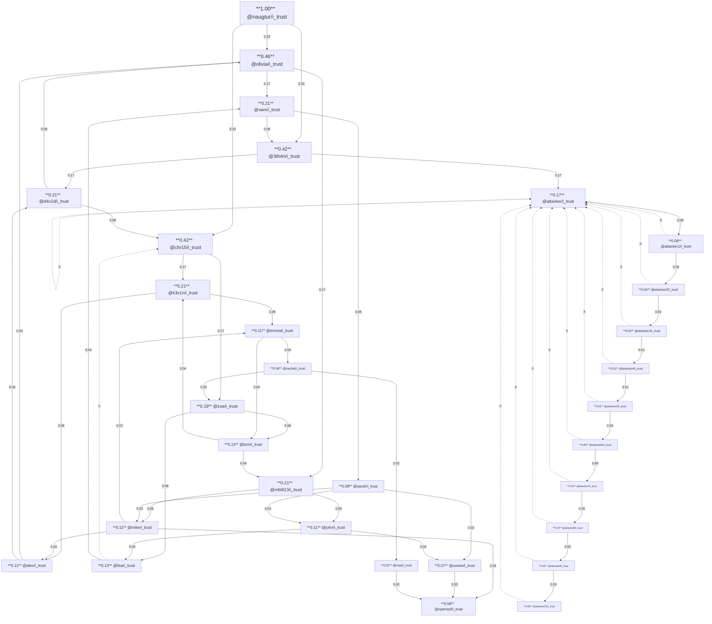

```mermaid
graph TD
  0["**1.00**  @naugtur/i_trust"]
style 0 font-size:26px;
  1["**0.46**  @olivia/i_trust"]
  0 --->|0.33| 1
  9 --->|0.08| 1
  14 --->|0.04| 1
style 1 font-size:24px;
  2["**0.42**  @chr15/i_trust"]
  0 --->|0.33| 2
  9 --->|0.08| 2
  15 -..->|X| 2
style 2 font-size:23px;
  3["**0.42**  @3th4n/i_trust"]
  0 --->|0.33| 3
  4 --->|0.08| 3
style 3 font-size:23px;
  4["**0.21**  @sam/i_trust"]
  1 --->|0.17| 4
  15 --->|0.04| 4
style 4 font-size:21px;
  5["**0.21**  @n4t4l13/i_trust"]
  1 --->|0.17| 5
  16 --->|0.04| 5
style 5 font-size:21px;
  6["**0.21**  @k3v1n/i_trust"]
  2 --->|0.17| 6
  16 --->|0.04| 6
style 6 font-size:21px;
  7["**0.19**  @zoe/i_trust"]
  2 --->|0.17| 7
  20 --->|0.02| 7
style 7 font-size:21px;
  8["**0.17**  @attacker/i_trust"]
  3 --->|0.17| 8
  8 -..->|X| 8
  17 -..->|X| 8
  21 -..->|X| 8
  23 -..->|X| 8
  24 -..->|X| 8
  25 -..->|X| 8
  26 -..->|X| 8
  27 -..->|X| 8
  28 -..->|X| 8
  29 -..->|X| 8
  30 -..->|X| 8
style 8 font-size:20px;
  9["**0.21**  @d4v1d/i_trust"]
  3 --->|0.17| 9
  14 --->|0.04| 9
style 9 font-size:21px;
  10["**0.08**  @sarah/i_trust"]
  4 --->|0.08| 10
style 10 font-size:18px;
  11["**0.11**  @mike/i_trust"]
  5 --->|0.08| 11
  10 --->|0.03| 11
style 11 font-size:19px;
  12["**0.11**  @john/i_trust"]
  5 --->|0.08| 12
  10 --->|0.03| 12
style 12 font-size:19px;
  13["**0.11**  @emma/i_trust"]
  6 --->|0.08| 13
  11 --->|0.03| 13
style 13 font-size:19px;
  14["**0.11**  @alex/i_trust"]
  6 --->|0.08| 14
  11 --->|0.03| 14
style 14 font-size:19px;
  15["**0.13**  @lisa/i_trust"]
  7 --->|0.08| 15
  12 --->|0.04| 15
style 15 font-size:19px;
  16["**0.13**  @tom/i_trust"]
  7 --->|0.08| 16
  13 --->|0.04| 16
style 16 font-size:19px;
  17["**0.08**  @attacker1/i_trust"]
  8 --->|0.08| 17
style 17 font-size:18px;
  18["**0.07**  @socket/i_trust"]
  10 --->|0.03| 18
  12 --->|0.04| 18
style 18 font-size:18px;
  19["**0.08**  @openssf/i_trust"]
  11 --->|0.03| 19
  18 --->|0.03| 19
  22 --->|0.02| 19
style 19 font-size:18px;
  20["**0.04**  @rachel/i_trust"]
  13 --->|0.04| 20
style 20 font-size:16px;
  21["**0.04**  @attacker2/i_trust"]
  17 --->|0.04| 21
style 21 font-size:16px;
  22["**0.02**  @snyk/i_trust"]
  20 --->|0.02| 22
style 22 font-size:15px;
  23["**0.02**  @attacker3/i_trust"]
  21 --->|0.02| 23
style 23 font-size:15px;
  24["**0.01**  @attacker4/i_trust"]
  23 --->|0.01| 24
style 24 font-size:14px;
  25["**0.01**  @attacker5/i_trust"]
  24 --->|0.01| 25
style 25 font-size:13px;
  26["**0.00**  @attacker6/i_trust"]
  25 --->|0.00| 26
style 26 font-size:13px;
  27["**0.00**  @attacker7/i_trust"]
  26 --->|0.00| 27
style 27 font-size:12px;
  28["**0.00**  @attacker8/i_trust"]
  27 --->|0.00| 28
style 28 font-size:12px;
  29["**0.00**  @attacker9/i_trust"]
  28 --->|0.00| 29
style 29 font-size:12px;
  30["**0.00**  @attacker10/i_trust"]
  29 --->|0.00| 30
style 30 font-size:12px;
```