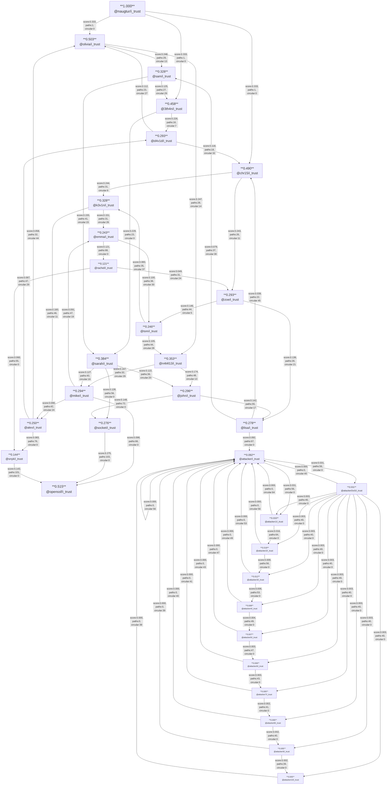

```mermaid
graph TD
  0["**1.000**<br>@naugtur/i_trust"]
style 0 font-size:24px;
  1["**0.503**<br>@olivia/i_trust"]
style 1 font-size:22px;
  2["**0.490**<br>@chr15/i_trust"]
style 2 font-size:22px;
  3["**0.458**<br>@3th4n/i_trust"]
style 3 font-size:22px;
  4["**0.328**<br>@sam/i_trust"]
style 4 font-size:21px;
  5["**0.353**<br>@n4t4l13/i_trust"]
style 5 font-size:21px;
  6["**0.328**<br>@k3v1n/i_trust"]
style 6 font-size:21px;
  7["**0.293**<br>@zoe/i_trust"]
style 7 font-size:21px;
  8["**0.293**<br>@d4v1d/i_trust"]
style 8 font-size:21px;
  9["**0.384**<br>@sarah/i_trust"]
style 9 font-size:22px;
  10["**0.294**<br>@mike/i_trust"]
style 10 font-size:21px;
  11["**0.296**<br>@john/i_trust"]
style 11 font-size:21px;
  12["**0.243**<br>@emma/i_trust"]
style 12 font-size:20px;
  13["**0.250**<br>@alex/i_trust"]
style 13 font-size:20px;
  14["**0.278**<br>@lisa/i_trust"]
style 14 font-size:21px;
  15["**0.246**<br>@tom/i_trust"]
style 15 font-size:20px;
  16["**0.276**<br>@socket/i_trust"]
style 16 font-size:21px;
  17["**0.515**<br>@openssf/i_trust"]
style 17 font-size:23px;
  18["**0.121**<br>@rachel/i_trust"]
style 18 font-size:18px;
  19["**0.144**<br>@snyk/i_trust"]
style 19 font-size:19px;
  20["**0.092**<br>@attacker/i_trust"]
style 20 font-size:18px;
  21["**0.031**<br>@attackerDoS/i_trust"]
style 21 font-size:15px;
  22["**0.033**<br>@attacker1/i_trust"]
style 22 font-size:15px;
  23["**0.019**<br>@attacker2/i_trust"]
style 23 font-size:14px;
  24["**0.012**<br>@attacker3/i_trust"]
style 24 font-size:14px;
  25["**0.008**<br>@attacker4/i_trust"]
style 25 font-size:13px;
  26["**0.007**<br>@attacker5/i_trust"]
style 26 font-size:13px;
  27["**0.006**<br>@attacker6/i_trust"]
style 27 font-size:13px;
  28["**0.005**<br>@attacker7/i_trust"]
style 28 font-size:13px;
  29["**0.005**<br>@attacker8/i_trust"]
style 29 font-size:13px;
  30["**0.005**<br>@attacker9/i_trust"]
style 30 font-size:13px;
  31["**0.005**<br>@attacker10/i_trust"]
style 31 font-size:13px;
  0 -->|" score:0.333, <br> paths:1, <br> circular:0"| 1
  8 -->|" score:0.112, <br> paths:23, <br> circular:27"| 1
  13 -->|" score:0.058, <br> paths:32, <br> circular:44"| 1
  0 -->|" score:0.333, <br> paths:1, <br> circular:0"| 2
  8 -->|" score:0.118, <br> paths:18, <br> circular:32"| 2
  14 -->|" score:0.039, <br> paths:22, <br> circular:45"| 2
  0 -->|" score:0.333, <br> paths:1, <br> circular:0"| 3
  4 -->|" score:0.125, <br> paths:27, <br> circular:29"| 3
  1 -->|" score:0.248, <br> paths:29, <br> circular:13"| 4
  14 -->|" score:0.079, <br> paths:37, <br> circular:30"| 4
  1 -->|" score:0.247, <br> paths:28, <br> circular:14"| 5
  15 -->|" score:0.105, <br> paths:44, <br> circular:28"| 5
  2 -->|" score:0.244, <br> paths:31, <br> circular:6"| 6
  15 -->|" score:0.083, <br> paths:35, <br> circular:37"| 6
  2 -->|" score:0.243, <br> paths:26, <br> circular:11"| 7
  18 -->|" score:0.049, <br> paths:31, <br> circular:24"| 7
  3 -->|" score:0.226, <br> paths:16, <br> circular:7"| 8
  13 -->|" score:0.067, <br> paths:47, <br> circular:29"| 8
  3 -->|" score:0.229, <br> paths:23, <br> circular:0"| 9
  4 -->|" score:0.155, <br> paths:41, <br> circular:15"| 9
  5 -->|" score:0.167, <br> paths:32, <br> circular:29"| 10
  9 -->|" score:0.127, <br> paths:40, <br> circular:16"| 10
  5 -->|" score:0.174, <br> paths:48, <br> circular:13"| 11
  9 -->|" score:0.122, <br> paths:36, <br> circular:20"| 11
  6 -->|" score:0.151, <br> paths:31, <br> circular:26"| 12
  10 -->|" score:0.091, <br> paths:47, <br> circular:19"| 12
  6 -->|" score:0.160, <br> paths:46, <br> circular:11"| 13
  10 -->|" score:0.090, <br> paths:42, <br> circular:24"| 13
  7 -->|" score:0.136, <br> paths:28, <br> circular:21"| 14
  11 -->|" score:0.142, <br> paths:55, <br> circular:17"| 14
  7 -->|" score:0.146, <br> paths:44, <br> circular:5"| 15
  12 -->|" score:0.100, <br> paths:38, <br> circular:30"| 15
  9 -->|" score:0.128, <br> paths:56, <br> circular:0"| 16
  11 -->|" score:0.148, <br> paths:72, <br> circular:0"| 16
  10 -->|" score:0.098, <br> paths:66, <br> circular:0"| 17
  16 -->|" score:0.275, <br> paths:103, <br> circular:0"| 17
  19 -->|" score:0.143, <br> paths:101, <br> circular:0"| 17
  12 -->|" score:0.121, <br> paths:68, <br> circular:0"| 18
  13 -->|" score:0.083, <br> paths:76, <br> circular:0"| 19
  18 -->|" score:0.060, <br> paths:55, <br> circular:0"| 19
  14 -->|" score:0.092, <br> paths:67, <br> circular:0"| 20
  20 -->|" score:0.000, <br> paths:0, <br> circular:56"| 20
  21 -->|" score:0.000, <br> paths:0, <br> circular:40"| 20
  22 -->|" score:0.000, <br> paths:0, <br> circular:64"| 20
  23 -->|" score:0.000, <br> paths:0, <br> circular:56"| 20
  24 -->|" score:0.000, <br> paths:0, <br> circular:53"| 20
  25 -->|" score:0.000, <br> paths:0, <br> circular:49"| 20
  26 -->|" score:0.000, <br> paths:0, <br> circular:47"| 20
  27 -->|" score:0.000, <br> paths:0, <br> circular:43"| 20
  28 -->|" score:0.000, <br> paths:0, <br> circular:41"| 20
  29 -->|" score:0.000, <br> paths:0, <br> circular:40"| 20
  30 -->|" score:0.000, <br> paths:0, <br> circular:39"| 20
  31 -->|" score:0.000, <br> paths:0, <br> circular:39"| 20
  20 -->|" score:0.031, <br> paths:56, <br> circular:0"| 21
  20 -->|" score:0.031, <br> paths:56, <br> circular:0"| 22
  21 -->|" score:0.003, <br> paths:40, <br> circular:0"| 22
  21 -->|" score:0.003, <br> paths:40, <br> circular:0"| 23
  22 -->|" score:0.016, <br> paths:64, <br> circular:0"| 23
  21 -->|" score:0.003, <br> paths:40, <br> circular:0"| 24
  23 -->|" score:0.009, <br> paths:56, <br> circular:0"| 24
  21 -->|" score:0.003, <br> paths:40, <br> circular:0"| 25
  24 -->|" score:0.006, <br> paths:53, <br> circular:0"| 25
  21 -->|" score:0.003, <br> paths:40, <br> circular:0"| 26
  25 -->|" score:0.004, <br> paths:49, <br> circular:0"| 26
  21 -->|" score:0.003, <br> paths:40, <br> circular:0"| 27
  26 -->|" score:0.003, <br> paths:47, <br> circular:0"| 27
  21 -->|" score:0.003, <br> paths:40, <br> circular:0"| 28
  27 -->|" score:0.003, <br> paths:43, <br> circular:0"| 28
  21 -->|" score:0.003, <br> paths:40, <br> circular:0"| 29
  28 -->|" score:0.002, <br> paths:41, <br> circular:0"| 29
  21 -->|" score:0.003, <br> paths:40, <br> circular:0"| 30
  29 -->|" score:0.002, <br> paths:40, <br> circular:0"| 30
  21 -->|" score:0.003, <br> paths:40, <br> circular:0"| 31
  30 -->|" score:0.002, <br> paths:39, <br> circular:0"| 31
```