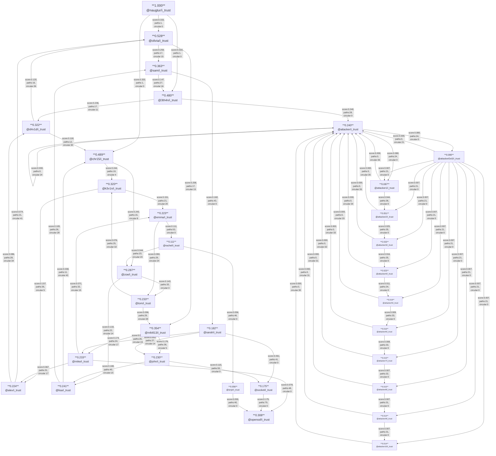

```mermaid
graph TD
  0["**1.000**<br>@naugtur/i_trust"]
style 0 font-size:24px;
  1["**0.528**<br>@olivia/i_trust"]
style 1 font-size:23px;
  2["**0.489**<br>@chr15/i_trust"]
style 2 font-size:22px;
  3["**0.480**<br>@3th4n/i_trust"]
style 3 font-size:22px;
  4["**0.363**<br>@sam/i_trust"]
style 4 font-size:22px;
  5["**0.354**<br>@n4t4l13/i_trust"]
style 5 font-size:21px;
  6["**0.320**<br>@k3v1n/i_trust"]
style 6 font-size:21px;
  7["**0.287**<br>@zoe/i_trust"]
style 7 font-size:21px;
  8["**0.240**<br>@attacker/i_trust"]
style 8 font-size:20px;
  9["**0.322**<br>@d4v1d/i_trust"]
style 9 font-size:21px;
  10["**0.182**<br>@sarah/i_trust"]
style 10 font-size:20px;
  11["**0.233**<br>@mike/i_trust"]
style 11 font-size:20px;
  12["**0.230**<br>@john/i_trust"]
style 12 font-size:20px;
  13["**0.223**<br>@emma/i_trust"]
style 13 font-size:20px;
  14["**0.224**<br>@alex/i_trust"]
style 14 font-size:20px;
  15["**0.241**<br>@lisa/i_trust"]
style 15 font-size:20px;
  16["**0.233**<br>@tom/i_trust"]
style 16 font-size:20px;
  17["**0.080**<br>@attackerDoS/i_trust"]
style 17 font-size:17px;
  18["**0.087**<br>@attacker1/i_trust"]
style 18 font-size:18px;
  19["**0.175**<br>@socket/i_trust"]
style 19 font-size:19px;
  20["**0.308**<br>@openssf/i_trust"]
style 20 font-size:21px;
  21["**0.111**<br>@rachel/i_trust"]
style 21 font-size:18px;
  22["**0.051**<br>@attacker2/i_trust"]
style 22 font-size:16px;
  23["**0.033**<br>@attacker3/i_trust"]
style 23 font-size:15px;
  24["**0.023**<br>@attacker4/i_trust"]
style 24 font-size:15px;
  25["**0.019**<br>@attacker5/i_trust"]
style 25 font-size:14px;
  26["**0.016**<br>@attacker6/i_trust"]
style 26 font-size:14px;
  27["**0.015**<br>@attacker7/i_trust"]
style 27 font-size:14px;
  28["**0.015**<br>@attacker8/i_trust"]
style 28 font-size:14px;
  29["**0.014**<br>@attacker9/i_trust"]
style 29 font-size:14px;
  30["**0.014**<br>@attacker10/i_trust"]
style 30 font-size:14px;
  31["**0.056**<br>@snyk/i_trust"]
style 31 font-size:16px;
  0 -->|" score:0.333, <br> paths:1, <br> circular:0"| 1
  9 -->|" score:0.120, <br> paths:16, <br> circular:26"| 1
  14 -->|" score:0.074, <br> paths:21, <br> circular:41"| 1
  0 -->|" score:0.333, <br> paths:1, <br> circular:0"| 2
  9 -->|" score:0.118, <br> paths:12, <br> circular:30"| 2
  15 -->|" score:0.038, <br> paths:11, <br> circular:43"| 2
  0 -->|" score:0.333, <br> paths:1, <br> circular:0"| 3
  4 -->|" score:0.147, <br> paths:27, <br> circular:16"| 3
  1 -->|" score:0.259, <br> paths:17, <br> circular:15"| 4
  15 -->|" score:0.105, <br> paths:26, <br> circular:28"| 4
  1 -->|" score:0.258, <br> paths:17, <br> circular:15"| 5
  16 -->|" score:0.096, <br> paths:29, <br> circular:28"| 5
  2 -->|" score:0.244, <br> paths:19, <br> circular:4"| 6
  16 -->|" score:0.076, <br> paths:25, <br> circular:32"| 6
  2 -->|" score:0.243, <br> paths:15, <br> circular:8"| 7
  21 -->|" score:0.044, <br> paths:23, <br> circular:23"| 7
  3 -->|" score:0.240, <br> paths:28, <br> circular:0"| 8
  8 -->|" score:0.000, <br> paths:0, <br> circular:24"| 8
  17 -->|" score:0.000, <br> paths:0, <br> circular:21"| 8
  18 -->|" score:0.000, <br> paths:0, <br> circular:36"| 8
  22 -->|" score:0.000, <br> paths:0, <br> circular:35"| 8
  23 -->|" score:0.000, <br> paths:0, <br> circular:35"| 8
  24 -->|" score:0.000, <br> paths:0, <br> circular:34"| 8
  25 -->|" score:0.000, <br> paths:0, <br> circular:33"| 8
  26 -->|" score:0.000, <br> paths:0, <br> circular:33"| 8
  27 -->|" score:0.000, <br> paths:0, <br> circular:32"| 8
  28 -->|" score:0.000, <br> paths:0, <br> circular:31"| 8
  29 -->|" score:0.000, <br> paths:0, <br> circular:31"| 8
  30 -->|" score:0.000, <br> paths:0, <br> circular:30"| 8
  3 -->|" score:0.236, <br> paths:17, <br> circular:11"| 9
  14 -->|" score:0.086, <br> paths:28, <br> circular:34"| 9
  4 -->|" score:0.182, <br> paths:43, <br> circular:0"| 10
  5 -->|" score:0.174, <br> paths:24, <br> circular:17"| 11
  10 -->|" score:0.059, <br> paths:26, <br> circular:15"| 11
  5 -->|" score:0.176, <br> paths:36, <br> circular:5"| 12
  10 -->|" score:0.053, <br> paths:27, <br> circular:14"| 12
  6 -->|" score:0.151, <br> paths:21, <br> circular:20"| 13
  11 -->|" score:0.071, <br> paths:33, <br> circular:15"| 13
  6 -->|" score:0.157, <br> paths:36, <br> circular:5"| 14
  11 -->|" score:0.067, <br> paths:31, <br> circular:17"| 14
  7 -->|" score:0.133, <br> paths:22, <br> circular:14"| 15
  12 -->|" score:0.108, <br> paths:40, <br> circular:15"| 15
  7 -->|" score:0.143, <br> paths:33, <br> circular:3"| 16
  13 -->|" score:0.090, <br> paths:29, <br> circular:24"| 16
  8 -->|" score:0.080, <br> paths:24, <br> circular:0"| 17
  8 -->|" score:0.080, <br> paths:24, <br> circular:0"| 18
  17 -->|" score:0.007, <br> paths:21, <br> circular:0"| 18
  10 -->|" score:0.061, <br> paths:41, <br> circular:0"| 19
  12 -->|" score:0.115, <br> paths:55, <br> circular:0"| 19
  11 -->|" score:0.078, <br> paths:48, <br> circular:0"| 20
  19 -->|" score:0.175, <br> paths:79, <br> circular:0"| 20
  31 -->|" score:0.055, <br> paths:40, <br> circular:0"| 20
  13 -->|" score:0.111, <br> paths:53, <br> circular:0"| 21
  17 -->|" score:0.007, <br> paths:21, <br> circular:0"| 22
  18 -->|" score:0.044, <br> paths:36, <br> circular:0"| 22
  17 -->|" score:0.007, <br> paths:21, <br> circular:0"| 23
  22 -->|" score:0.025, <br> paths:35, <br> circular:0"| 23
  17 -->|" score:0.007, <br> paths:21, <br> circular:0"| 24
  23 -->|" score:0.016, <br> paths:35, <br> circular:0"| 24
  17 -->|" score:0.007, <br> paths:21, <br> circular:0"| 25
  24 -->|" score:0.011, <br> paths:34, <br> circular:0"| 25
  17 -->|" score:0.007, <br> paths:21, <br> circular:0"| 26
  25 -->|" score:0.009, <br> paths:33, <br> circular:0"| 26
  17 -->|" score:0.007, <br> paths:21, <br> circular:0"| 27
  26 -->|" score:0.008, <br> paths:33, <br> circular:0"| 27
  17 -->|" score:0.007, <br> paths:21, <br> circular:0"| 28
  27 -->|" score:0.007, <br> paths:32, <br> circular:0"| 28
  17 -->|" score:0.007, <br> paths:21, <br> circular:0"| 29
  28 -->|" score:0.007, <br> paths:31, <br> circular:0"| 29
  17 -->|" score:0.007, <br> paths:21, <br> circular:0"| 30
  29 -->|" score:0.007, <br> paths:31, <br> circular:0"| 30
  21 -->|" score:0.056, <br> paths:46, <br> circular:0"| 31
```