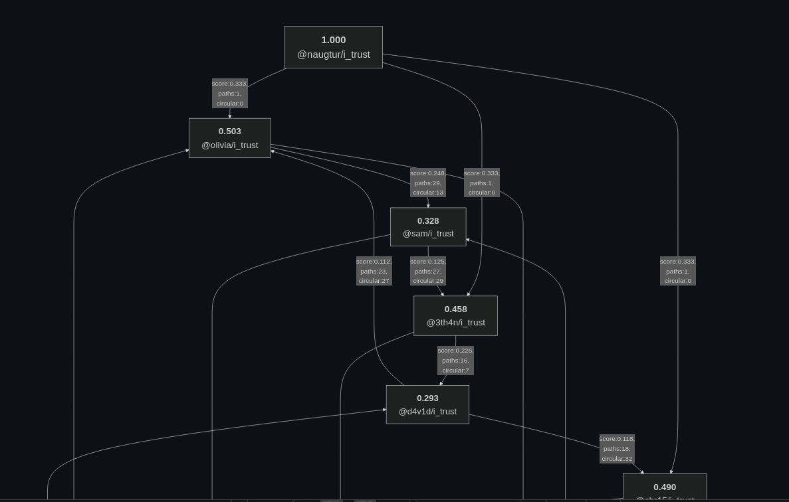
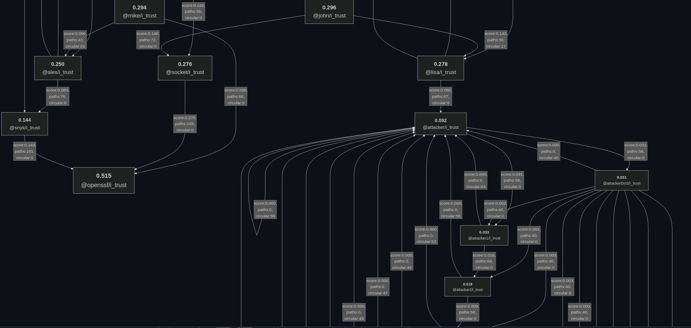
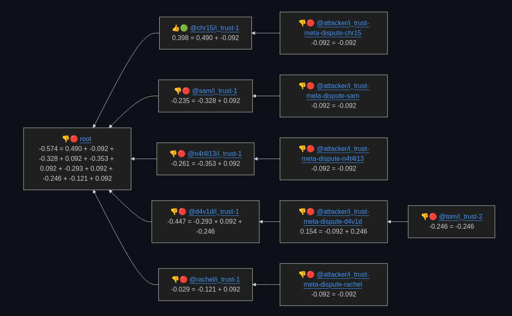

# a CYPHERPUNK hackathon entry

---

# Trust Graph for NPM

Enhancing Supply Chain Security with Community Trust

---

# Our Goal

Create a distributed network of trust for sharing and consuming opinions on npm packages and their vulnerabilities.

- bootstrapped on the existing ecosystem
- possible to use "by the way" and trivial to adopt
- eliminate the need for an institution to take responsibility for the content

---

# Trust Graph Explained

- Social graph of trust built on npm
- Users publish `@username/i_trust` packages
- Trust spreads proportionally through dependencies
- Simple and resistant to Sybil attacks

---

# Trust Scores

- Derived from the user's position in the trust graph
- Range from 0 to 1
- Used to weigh assertions in the network
- Enables personalized, community-driven vulnerability assessments

---

# Assertions

- Stored in JSON files or endpoints
- Can endorse (+1) or dispute (-1) claims about packages
- Include subject, claim, and trust score
- Easily queried and consumed by tools

---

# Trust graph

- computed scores and the trickle-down effect on the whole graph
- attack resistance

> Fragments of the trust graph computation visualized below

---

---

---

# Assertions matching and weight

- query for assertions about a subject
- weight to represent how much you trust the peers listed
- summarize to one sentiment score

---

---

# Applications and Impact

1. Filter npm audit results based on trusted opinions
2. Reduce noise from unnecessary vulnerability reports
3. Empower the community to collaboratively dismiss bogus CVEs
4. Avoid creating a centralized mess with no authority willing to moderate it

---

# Resources

project: [github.com/naugtur/trust-graph](https://github.com/naugtur/trust-graph)

[trust graph example](https://github.com/naugtur/trust-graph/blob/main/graph-example/testenv/computed_trust.md)
[sentiment visualized](https://github.com/naugtur/trust-graph/blob/main/graph-example/testenv/computed_sentiment.md)